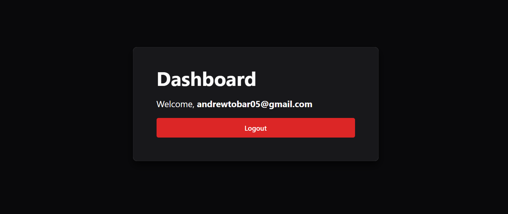

# Firebase Authentication with React + TypeScript + Vite

This project demonstrates a simple authentication system using **Firebase Authentication**, **React**, **TypeScript**, and **Vite**. It includes features like login, registration, password reset, and a protected dashboard.

## Features

- **Login**: Users can log in with email/password or third-party providers like Google and GitHub.
- **Registration**: Users can create an account using their email and password.
- **Password Reset**: Users can reset their password via email.
- **Protected Dashboard**: Only authenticated users can access the dashboard.
- **Responsive Design**: Built with Chakra UI for a clean and responsive interface.

---

## Getting Started

Follow these steps to run the application locally.

### Prerequisites

- **Node.js**: Ensure you have Node.js installed.
- **Firebase Project**: Set up a Firebase project and enable **Email/Password**, **Google**, and **GitHub** authentication providers.

### Installation

1. Clone the repository:
   ```bash
   git clone https://github.com/citruspunch/FirebaseAuthentication.git
   cd FirebaseAuthentication
   ```

2. Install dependencies:
   ```bash
   npm install
   ```

3. Start the development server:
   ```bash
   npm run dev
   ```

4. Open your browser and navigate to `http://localhost:5173`.

---

## Live Preview

You can view a live preview of the application on CodeSandbox:

[](https://codesandbox.io/p/github/citruspunch/FirebaseAuthentication/main?import=true)

---

## Example Usage

### Login Page
Users can log in using their email and password or third-party providers like Google and GitHub.


### Registration Page
New users can create an account by providing their email and password.


### Password Reset
Users can reset their password by entering their email address.


### Dashboard
Authenticated users can access the dashboard, which displays a welcome message and a logout button.


---

## Project Structure

```
src/
├── components/
│   ├── Login.tsx          # Login page
│   ├── Register.tsx       # Registration page
│   ├── PasswordReset.tsx  # Password reset page
│   ├── Dashboard.tsx      # Protected dashboard
│   └── ui/                # UI components
├── FirebaseConfig.ts      # Firebase configuration
├── App.tsx                # Main application component
├── main.tsx               # Application entry point
index.html                 # HTML template
```

---

## Technologies Used

- **React**: Frontend library for building user interfaces.
- **TypeScript**: Strongly typed JavaScript for better development experience.
- **Vite**: Fast build tool for modern web projects.
- **Firebase Authentication**: Backend service for user authentication.
- **Chakra UI**: Component library for responsive and accessible design.

---
